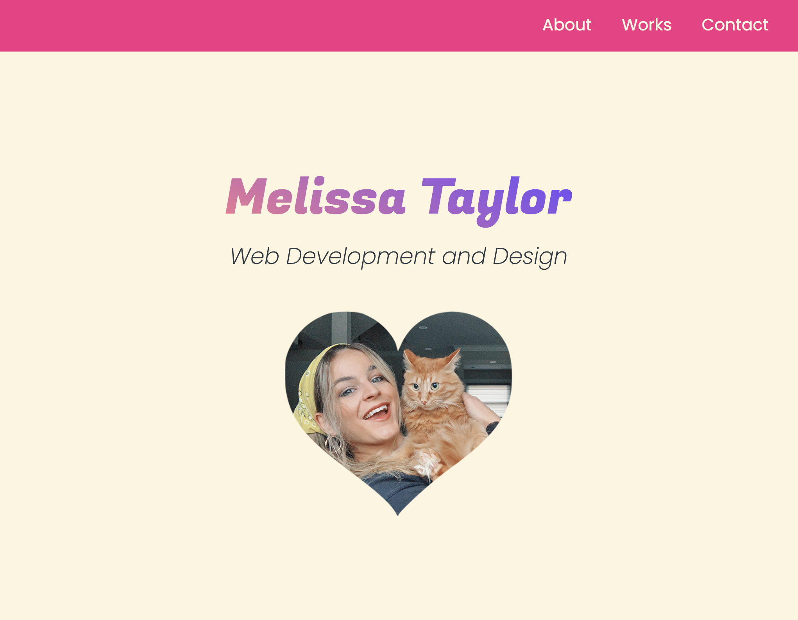
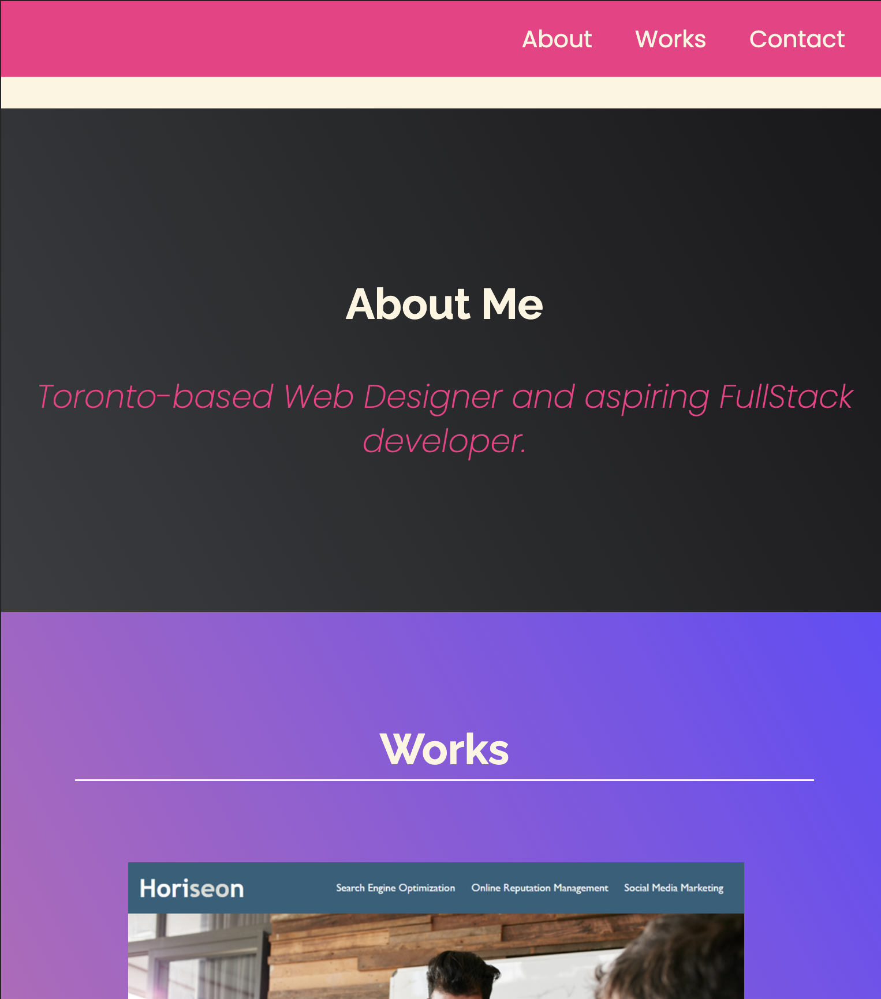
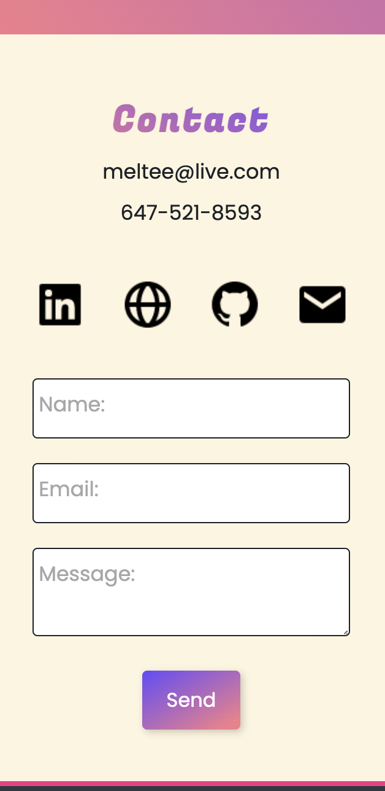

# Challenge 02 - Melissa Taylor Web Design & Development Portfolio
January 17th, 2023

# Deployment Link

# Description
### Why was this project significant?
In contrasast to the previous challenge, this weeks challenge asked learners in the Fullstack Flex course to build code from scratch. The lessons taught in Module 2 centered on Advanced CSS, with focuses on FlexBox, media queries, pseudo elements, CSS resets, and more. This project aimed to familiarize students with the fastideous nature of CSS, which can require lots of trial and error. After this project - building a site page with CSS and HTML from scratch - students will understand the time-consuming nature of CSS, and will consequently consider this when time-managing for future projects. Additionally, this project will be built upon further in future challenges, to help students expand and display their portfolio of web-development work - which can hopefully be used for our job-search post-grad.

### What did this project ask of us? 
The Module 2 Challenge was building a web application from scratch. Students were asked to build a portfolio page, with the intention of showcasing our web-development skills to future employers. Our portfolio page was asked to meet certain requirements, such as: having working page navigation, images (with titles) that link to our portfolio work, and ensuring that the whole page works responsively on any device screen. 
Students were asked to link their github repo to their local computer, so we may practice organized Github habits such as pushing often and using commit messages. At the end, we are asked to deploy our new portfolio page to github pages. 

# Screenshot
Here are various screenshots of my finished site page in different screen sizes:
### Desktop/Laptop

### Tablet

### Mobile

# Liscenses/Credits

The MIT License (MIT)

I used Boxicons, a free collection of carefully crafted open source icons. They also operate under an MIT License. Learn more about their usage here: https://boxicons.com/usage#license

